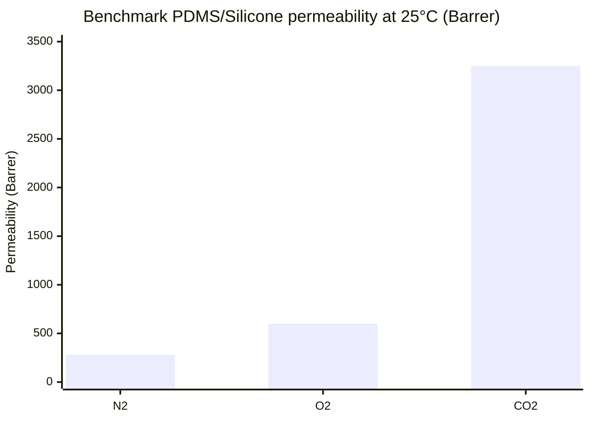

# Software Simulation Design for Gas Exchange Through Sani‑Tech Ultra Silicone Tubing into PBS

## Executive summary

This report outlines a software simulation design to predict **O₂/CO₂/N₂ transfer from a gas stream inside Saint‑Gobain Sani‑Tech® Ultra‑C silicone tubing into an aqueous PBS medium** in a “tube‑in‑chamber” carboxygenator. The recommended baseline model couples (i) **1D axial convection in the tube gas**, (ii) **dense‑polymer solution‑diffusion membrane permeation** through silicone, and (iii) **liquid mixing/transport** in the chamber (starting with a well‑mixed model, expandable to advection–diffusion CFD). Geometry for **ULTRA‑C‑125‑1** is taken from Saint‑Gobain: **ID 0.125 in (3.2 mm), OD 0.188 in (4.8 mm), wall 0.032 in (~0.8 mm)** citeturn27view0, consistent with the wall‑code convention **“1 = 0.79 mm”**, and coil designations **F = 50 ft, H = 100 ft** citeturn27view2.

Because **ULTRA‑specific gas permeability is generally not published**, the design uses **PDMS benchmark permeabilities** from Robb’s classic silicone permeation work (“Thin Silicone Membranes…”, 25 °C; values widely reused for PDMS/silicone membranes), supported by an application note table and Robb’s original experimental description citeturn28view0turn20view0turn24search3. At 25 °C, representative permeabilities (Barrer) are **N₂ ≈ 280**, **O₂ ≈ 600**, **CO₂ ≈ 3250** citeturn20view0turn28view0, yielding polymer‑limited fluxes (t = 0.79 mm) at Δp = 1 atm of roughly:
- **Jₙ₂ ≈ 1.2×10⁻⁵ mol·m⁻²·s⁻¹**
- **Jₒ₂ ≈ 2.6×10⁻⁵ mol·m⁻²·s⁻¹**
- **J𝚌𝚘₂ ≈ 1.4×10⁻⁴ mol·m⁻²·s⁻¹**  
(using 1 Barrer = 3.348×10⁻¹⁶ mol·m·m⁻²·s⁻¹·Pa⁻¹ citeturn6search6 and 1 atm = 101325 Pa citeturn6search12). In practice, **liquid‑side mass transfer** can dominate; the design therefore includes a **resistance‑in‑series** framework (gas film + membrane + liquid film) based on standard two‑film mass transfer theory citeturn18view2turn22search30, and provides correlations (Sherwood‑number) to parameterize liquid‑side coefficients for flow past cylinders or turbulent pipe flow citeturn21view1turn21view0.

Key gaps that drive uncertainty are: (1) true **ULTRA‑C permeability** (formulation/filler effects), and (2) **liquid‑side kₗ** in your chamber’s hydrodynamics. The report closes with a validation plan and standards pathways (ASTM D1434 / ISO 15105) to obtain measured permeability/permeance citeturn16search3turn22search5.

## System definition and scope

### Physical system and geometry assumptions

Tubing definition (target configuration):
- Tubing family: **Sani‑Tech® Ultra‑C** (50 Shore A grade, per Saint‑Gobain’s part‑number scheme where “C = 50 Shore”) citeturn27view2.
- Part number: **ULTRA‑C‑125‑1** (standard size table) with:
  - **ID = 0.125 in (3.2 mm)**
  - **OD = 0.188 in (4.8 mm)**
  - **Wall = 0.032 in (~0.8 mm)**
  - (Burst pressure listed, but not needed for transport modeling) citeturn27view0.
- Wall‑code convention: **wall code “1” corresponds to 1/32" = 0.79 mm** citeturn27view2.
- Coil length convention: **F = 50 ft coil, H = 100 ft coil (25 ft has no designation)** citeturn27view2.

Geometric abstraction for the simulator:
- Represent the coil as an equivalent straight tube of length L, with external surface area  
  \(A_m = \pi d_{o} L\), where \(d_o = 4.8\,\text{mm}\) citeturn27view0.
- The surrounding chamber liquid (PBS) can be modeled at three fidelity levels:
  1) **0D well‑mixed (CSTR)**: single bulk concentration per species in the chamber.
  2) **1D plug‑flow around coil**: axial concentration gradient in liquid (if there is a dominant circulation path).
  3) **2D/3D advection–diffusion** (CFD‑style) for detailed hydrodynamics.

### Intended outputs and non‑goals

Primary outputs:
- **Species fluxes** \(J_{O_2}, J_{CO_2}, J_{N_2}\) (mol·m⁻²·s⁻¹) and integrated transfer rates (mol·s⁻¹).
- **Dissolved concentrations vs time** (and optionally vs position): \(C_i(t)\) or \(C_i(\mathbf{x},t)\).
- **CO₂‑driven pH evolution** in PBS, via carbonate + phosphate buffering equilibria (and optional hydration kinetics).

Non‑goals (unless expanded later):
- Bubble nucleation, foaming, membrane swelling/mechanical deformation, leakage paths, or wetting failure modes (more relevant to porous membranes than dense silicone).

## Governing physics and equations

### Membrane permeation through dense silicone

Dense silicone typically follows **solution–diffusion transport**, where permeability \(P_i\) is treated as a material property, and flux is proportional to driving force and inversely proportional to thickness citeturn20view0turn24search3:

\[
J_i = \Pi_i \, \Delta p_i, \qquad \Pi_i = \frac{P_i}{\delta}
\]

with:
- \(J_i\): molar flux of species \(i\) (mol·m⁻²·s⁻¹),
- \(\Pi_i\): permeance (mol·m⁻²·s⁻¹·Pa⁻¹),
- \(P_i\): permeability (mol·m·m⁻²·s⁻¹·Pa⁻¹ or Barrer),
- \(\delta\): wall thickness (m),
- \(\Delta p_i\): transmembrane **partial pressure** difference (Pa).

Benchmark PDMS/silicone permeabilities at 25 °C (basis for the model):
- From Robb’s silicone permeation measurements at 25 °C citeturn28view0, as tabulated for PDMS/silicone membranes in Barrer: **N₂ 280, O₂ 600, CO₂ 3250** citeturn20view0turn28view0. Robb specifies permeation rates reported at 25 °C in terms of “cc’s … at one atm and 25 °C” (important for unit handling) citeturn28view0.

Unit conversion used by the simulator:
- \(1\ \text{Barrer} = 3.348\times10^{-16}\ \text{mol·m}\,\text{m}^{-2}\,\text{s}^{-1}\,\text{Pa}^{-1}\) citeturn6search6.
- Standard volumetric flow conversions should be reported explicitly; NIST cautions that “standard” flow units depend on the assumed reference conditions citeturn6search12.

### Coupling to dissolved concentrations via Henry’s law

At the liquid interface, equilibrium between dissolved gas concentration and gas partial pressure is represented with the **Henry solubility constant** \(H_{cp}\) defined as \(c/p\) at infinite dilution citeturn12search3turn12search16:

\[
c_i^{*} = H_{cp,i}\, p_i
\quad\Rightarrow\quad
p_i^{*} = \frac{c_i}{H_{cp,i}}
\]

Henry constants in water at 298.15 K (25 °C), expressed as \(H_{cp}\) in mol·m⁻³·Pa⁻¹:
- **O₂:** \(H_{cp}\approx 1.3\times10^{-5}\) citeturn15view1  
- **N₂:** \(H_{cp}\approx 6.4\times10^{-6}\) citeturn14view1  
- **CO₂:** \(H_{cp}\approx 3.3\text{–}3.4\times10^{-4}\) citeturn13view0

PBS is close to water for first‑pass solubility modeling; salinity/ionic strength corrections can be added later if needed.

### Resistances in series: gas film + membrane + liquid film

To avoid over‑predicting transfer (common if you assume bulk liquid concentration exists directly at the membrane surface), use a resistance‑in‑series model. The **two‑film framework** gives overall transfer relations combining gas‑side and liquid‑side mass transfer and Henry coupling citeturn18view2. For a dense membrane contactor, add the membrane resistance \(\delta/P_i\) in series:

\[
J_i =
\frac{p_{i,g} - p_{i,l}^{*}}
{\left(\frac{1}{k_{p,i}}\right) \;+\; \left(\frac{\delta}{P_i}\right) \;+\; \left(\frac{1}{H'_i k_{c,i}}\right)}
\]

where:
- \(k_{p,i}\): gas‑phase mass transfer coefficient with pressure driving force,
- \(k_{c,i}\): liquid‑phase mass transfer coefficient with concentration driving force,
- \(H'_i\): Henry constant in the form \(c = H' p\) (consistent with \(H_{cp}\)) citeturn18view2.

This structure makes it easy to diagnose limiting regimes:
- **Membrane‑limited:** \(\delta/P_i \gg 1/(H'k_c)\)
- **Liquid‑film‑limited:** \(1/(H'k_c) \gg \delta/P_i\)

### Gas‑phase axial balance inside the tube

Model the tube side as **1D convection with a distributed sink/source** due to permeation:

\[
\frac{d\dot n_i}{dz} = - 2\pi r_o\, J_i(z)
\]

where \(z\) is axial length and \(r_o = d_o/2\). Total pressure can be:
- prescribed from measured signals (preferred per your requirement), or
- computed from a pressure‑drop submodel (Poiseuille/Darcy‑Weisbach), if desired (secondary).

### Liquid‑phase model: mixing and transport

Start with a well‑mixed chamber (CSTR) for robustness:

\[
V\frac{dC_i}{dt} = A_m \, J_i \;+\; Q_{in}C_{i,in} \;-\; Q_{out}C_{i}
\]

Extend to advection–diffusion (2D/3D) when you need spatial gradients:

\[
\frac{\partial C_i}{\partial t} + \mathbf{u}\cdot \nabla C_i
= D_i \nabla^2 C_i + R_i
\]

with \(R_i\) capturing CO₂ chemistry (below).

### CO₂ chemistry and pH in PBS

Minimum viable chemistry model:
- Track **dissolved “free” CO₂(aq)** as the species that couples to Henry’s law driving force.
- Compute pH from equilibria of:
  - carbonic acid dissociation constants (25 °C):  
    \(K_{a1}\approx 4.5\times10^{-7}\) (pKa₁ ≈ 6.35) and \(K_{a2}\approx 4.7\times10^{-11}\) (pKa₂ ≈ 10.33) citeturn30view1  
  - phosphoric acid second dissociation (buffer near PBS pH):  
    \(K_{a2}\approx 6.2\times10^{-8}\) (pKa₂ ≈ 7.21) citeturn30view1

Optional kinetics (if you see transient lag between CO₂ flux and pH response):
- Uncatalyzed hydration/dehydration is finite; BioNumbers reports a representative uncatalyzed dehydration rate constant \(k \approx 0.037\,\text{s}^{-1}\) and cites rate constants around 25 °C citeturn17view0. If carbonic anhydrase is absent (typical in PBS), this can matter for second‑to‑minute time scales.

## Inputs, properties, and example calculations

### Required input parameter table

| Category | Parameter | Symbol / Units | Typical value / range | Source / notes |
|---|---|---:|---:|---|
| Tubing geometry | Inner diameter | \(d_i\) [m] | 3.2 mm | ULTRA‑C‑125‑1 citeturn27view0 |
|  | Outer diameter | \(d_o\) [m] | 4.8 mm | ULTRA‑C‑125‑1 citeturn27view0 |
|  | Wall thickness | \(\delta\) [m] | 0.79 mm (wall‑code 1) | Wall‑code mapping citeturn27view2 |
|  | Coil length | \(L\) [m] | 15.24 m (50 ft “F”) or 30.48 m (100 ft “H”) | Coil designation citeturn27view2 |
| Membrane transport | Permeability (benchmark) | \(P_i\) [Barrer] | N₂ 280, O₂ 600, CO₂ 3250 | PDMS/silicone benchmark citeturn20view0turn28view0 |
| Henry’s law | Solubility constant | \(H_{cp,i}\) [mol·m⁻³·Pa⁻¹] | O₂ 1.3e‑5; N₂ 6.4e‑6; CO₂ 3.3e‑4 | 298.15 K data citeturn15view1turn14view1turn13view0 |
| Liquid diffusion | Diffusivity in water | \(D_i\) [m²·s⁻¹] | O₂ ≈ 2.0e‑9 citeturn7view2; N₂ ≈ 2.01e‑9 citeturn10view0; CO₂ ≈ 1.88e‑9 citeturn7view1 | PBS ≈ water first pass |
| Water properties (25 °C) | Density, viscosity | \(\rho,\mu\) | \(\rho\approx 0.997\,\text{g·cm}^{-3}\), \(\mu\approx 0.89\,\text{mPa·s}\) | IAPWS‑based table citeturn26view0 |
| Mass transfer coeffs | Correlations (if used) | Sh/ Re/ Sc | Cylinder cross‑flow: \(Sh=0.61Re^{1/2}Sc^{1/3}\); turbulent pipe: \(Sh=0.023Re^{0.8}Sc^{1/3}\) | Correlation notes citeturn21view1turn21view0 |
| Chemistry | Carbonic acid / phosphoric acid equilibria | \(K_a\), pKa | Carbonic: pKa₁ 6.35, pKa₂ 10.33; Phosphoric pKa₂ 7.21 | CRC‑sourced table citeturn30view1 |
| Operating BCs | Gas pressure/composition/flow | \(p(t), y_i(t), \dot V_g(t)\) | Parameter sweep | Use measured logs as boundary conditions |
| Operating BCs | Liquid volume/flow | \(V, Q_l, \mathbf{u}(\mathbf{x},t)\) | Parameter sweep | Use pump curves/measurements |

### Example: polymer‑limited permeance and flux (t = 0.79 mm)

Using \(1\ \text{Barrer} = 3.348\times10^{-16}\ \text{mol·m·m}^{-2}\text{s}^{-1}\text{Pa}^{-1}\) citeturn6search6 and \(\delta=0.79\ \text{mm}\) citeturn27view2:

Permeance \(\Pi_i = P_i/\delta\) (mol·m⁻²·s⁻¹·Pa⁻¹):
- N₂ (280 Barrer): \(\Pi \approx 1.19\times10^{-10}\)
- O₂ (600 Barrer): \(\Pi \approx 2.54\times10^{-10}\)
- CO₂ (3250 Barrer): \(\Pi \approx 1.38\times10^{-9}\)

Flux \(J_i = \Pi_i \Delta p\) for two driving forces:
- Δp = **1 atm** (101325 Pa) citeturn6search12  
  - \(J_{N_2}\approx 1.2\times10^{-5}\) mol·m⁻²·s⁻¹  
  - \(J_{O_2}\approx 2.6\times10^{-5}\) mol·m⁻²·s⁻¹  
  - \(J_{CO_2}\approx 1.4\times10^{-4}\) mol·m⁻²·s⁻¹
- Δp = **0.1 atm** → fluxes are ~10× lower (linear model).

If you assume a 100‑ft coil (“H”), the membrane area is \(A_m=\pi d_o L\) with \(d_o=4.8\) mm and \(L=30.48\) m citeturn27view0turn27view2, giving \(A_m\approx 0.46\ \text{m}^2\). This yields (polymer‑limited, Δp=1 atm) total transfer rates of order:
- O₂: \(\dot n \approx 1.2\times10^{-5}\) mol·s⁻¹ (≈ 16 sccm at “standard” reference conditions; note that “standard” varies by convention) citeturn6search12  
- CO₂: \(\dot n \approx 6.4\times10^{-5}\) mol·s⁻¹ (≈ 86 sccm)

These are *upper‑bound* estimates because real systems typically have additional film resistances citeturn18view2turn22search30.

### Comparison chart: benchmark PDMS permeability (25 °C)



Data basis: Robb (25 °C silicone permeation measurements) citeturn28view0 as commonly tabulated for PDMS/silicone membranes citeturn20view0.

## Numerical methods, coupling strategy, and implementation plan

### Recommended model hierarchy

Adopt a staged architecture so the tool is useful immediately and extensible:

**Tier A (fast, robust): 0D liquid + 1D gas**
- Gas: 1D along tube.
- Liquid: well‑mixed chamber (single \(C_i(t)\)).
- Chemistry: equilibrium pH model (carbonate + phosphate), optional CO₂ hydration kinetics citeturn30view1turn17view0.

**Tier B (engineering): 1D gas + 1D liquid plug‑flow**
- Useful if there is a strong circulation path producing a temperature or composition gradient.

**Tier C (high fidelity): 1D gas + 2D/3D liquid advection–diffusion**
- Use CFD‑like discretization for \(\mathbf{u}\) and \(C_i(\mathbf{x},t)\).
- Still keep membrane as a boundary condition (thin‑wall approximation) rather than meshing the silicone volume.

### Discretization and time integration

Recommended numerics:
- **Finite Volume Method (FVM)** for conservation (gas 1D and liquid 1D/2D/3D).
- **Operator splitting**: advection–diffusion step + reaction/speciation step (CO₂).
- **Implicit (or IMEX) time stepping** for diffusion/reaction stiffness to avoid severe Δt restrictions.

Stability guidance (if any explicit advection is used):
- Use upwind‑type treatment for convection (to prevent nonphysical oscillations).
- Enforce a CFL‑type constraint when explicit stepping is used; the CFL concept is standard for advection discretizations citeturn23search11.

### Mass transfer coefficient parameterization (kₗ, k_g)

If you model film resistances rather than assuming interface = bulk:
- Compute \(k_l\) from Sherwood correlations: \(Sh = k_l d / D\).
- For cross‑flow around a tube segment: \(Sh = 0.61 Re^{1/2} Sc^{1/3}\) citeturn21view1.
- For turbulent flow inside a pipe (if you need gas‑side film inside the tube or liquid inside a tube model): \(Sh = 0.023 Re^{0.8} Sc^{1/3}\) citeturn21view0.
- Combine gas/liquid films with Henry coupling using overall‑coefficient relations from two‑film theory citeturn18view2, then add membrane resistance \(\delta/P\).

### Software module roadmap (no code)

Core modules:
- **Geometry module:** tubing sizes from PN; computes \(A_m\), internal volume, surface area per axial cell. Uses ULTRA‑C‑125‑1 dimensions and wall‑code map citeturn27view0turn27view2.
- **Property library:**
  - \(P_i(T)\): baseline PDMS values at 25 °C plus temperature dependence placeholders (Arrhenius‑like) using literature if later added. Robb notes extensive dependence on thickness/temperature/composition in silicone systems citeturn28view0.
  - Henry constants \(H_{cp,i}(T)\) from Henry’s law database or IAPWS if you extend beyond 25 °C citeturn15view1turn14view1turn13view0turn24search2.
  - Diffusivities \(D_i\) and water properties (μ, ρ) at 25 °C citeturn7view2turn10view0turn7view1turn26view0.
- **Boundary condition module:** ingests measured \(p(t)\), \(T(t)\), gas composition \(y_i(t)\), gas flowrate (or computes it from PID/pump models), and liquid pump speed/flow.
- **Flux module:** computes \(J_i\) using either:
  - membrane‑only \(J_i=(P_i/\delta)(p_{i,g}-p_{i,l}^*)\), or
  - full resistance‑in‑series using two‑film + membrane citeturn18view2turn22search30.
- **Gas solver (1D):** solves for \(\dot n_i(z)\) with permeation sinks.
- **Liquid solver:** 0D CSTR or advection–diffusion.
- **Chemistry/pH solver:** carbonate + phosphate equilibrium using pKa values; optional kinetics for CO₂ hydration based on literature rate constants citeturn30view1turn17view0.
- **Experiment manager:** parameter sweeps over gas composition/flow, pump speeds, Δp cases (1 atm, 0.1 atm), and temperature.

Flowchart of simulation components:

```mermaid
flowchart TD
  A[Input data: ULTRA-C-125-1 geometry, wall 0.79 mm, gas BCs p(t), y(t), flow; liquid BCs V, pump] --> B[Property library: P_i, Hcp_i, D_i, water μ/ρ]
  B --> C[Gas 1D convection solver along tube]
  B --> D[Liquid model: 0D CSTR or 1D/2D advection-diffusion]
  C --> E[Membrane + film resistance model -> J_i(z,t)]
  D --> E
  E --> C
  E --> D
  D --> F[CO2 speciation + phosphate buffering -> pH(t)]
  F --> D
  C --> G[Outputs: J_i, ndot_i, C_i(t,x), pH(t), limiting resistances]
  D --> G
  F --> G
  G --> H[Validation reports + parameter sweep plots]
```

## Verification, validation, and standards-based next steps

### Verification strategy (mathematical correctness)

Use tests that must pass before comparing with experiments:
- **Mass conservation:** integrated membrane flux over area equals net change in tube‑side molar flow + net accumulation in liquid.
- **Limiting cases:**
  - \(k_l\to\infty\): reduces to membrane‑limited \(J=(P/\delta)\Delta p\).
  - \(P/\delta\to\infty\): reduces to film‑controlled \(J \approx k_l(C^*-C)\) consistent with two‑film forms citeturn18view2.
- **Analytical step response (0D liquid):** with constant \(J\) linearized near operating point, expect exponential approach with time constant \(\tau \sim V/(A K)\).

### Validation datasets to collect (practical)

Minimum experimental datasets (suggested):
- **Dissolved O₂ step tests:** switch tube gas from air → O₂ (or N₂ → O₂) while recording dissolved oxygen (DO) vs time.
- **CO₂ step tests:** switch to a known CO₂ partial pressure; record pH(t) and (if available) dissolved CO₂ or total inorganic carbon estimates; uncatalyzed hydration can introduce lag citeturn17view0.
- **Pressure/flow logs:** inlet/outlet gas pressure and flow rate time series (already in your requirement).
- **Hydrodynamic characterization:** pump speed → liquid flow mapping; even a dye‑mixing time constant helps bound effective kₗ.

### Standards context for obtaining ULTRA‑specific permeability

If ULTRA‑C permeability/permeance is needed for accuracy (likely), the most defensible path is controlled testing:
- **ASTM D1434** is a standard manometric method that determines **gas transmission rate (GTR), permeance, and (for homogeneous materials) permeability** citeturn16search3.
- **ISO 15105** specifies differential‑pressure methods to determine gas transmission rates of plastic films/sheeting (commonly used for barrier measurements) citeturn22search5.

Because tubing is not a flat film, you would either:
- request Saint‑Gobain internal permeability/permeation data for ULTRA‑C (if available), or
- cut and prepare representative film specimens (or use a custom tubing test cell) while reporting the effective thickness and area.

### Key gaps and next steps

- **Obtain ULTRA‑C gas permeability (O₂/CO₂/N₂)**: current model uses PDMS benchmark values (Robb‑derived) citeturn28view0turn20view0, which may differ from the ULTRA formulation.
- **Measure or bound liquid‑side kₗ** in the carboxygenator: film resistance can dominate; use Sherwood correlations only as a first estimate citeturn21view1turn18view2.
- **Decide CO₂ chemistry fidelity:** equilibrium is often fine for minute+ time scales; add kinetics if pH response is lagged relative to flux, using literature rate constants citeturn17view0.